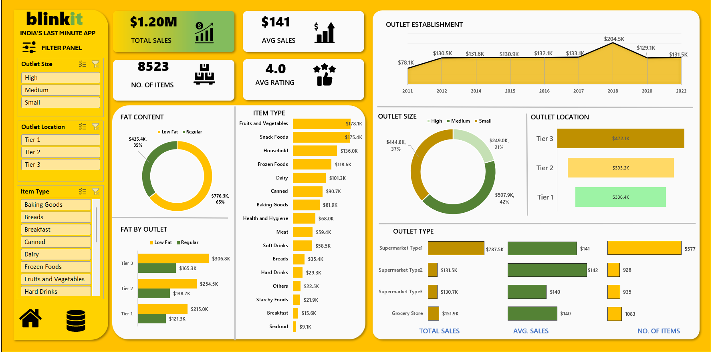

# Blinkit Sales Analysis Dashboard (Excel Project)

## Project Overview
This project is an interactive Excel dashboard created to analyze Blinkit sales data and business performance.

## Tools Used
- Microsoft Excel
- Pivot Tables
- Pivot Charts
- Slicers
- Conditional Formatting

## Dashboard Features
- Interactive filtering
- Sales trend analysis
- Outlet performance tracking
- Item category analysis
- KPI cards

## KPIs
- Total Sales: $1.20M
- Average Sales: $141
- Number of Items: 8523
- Average Rating: 4.0

## Skills Demonstrated
- Data Cleaning
- Data Visualization
- Dashboard Design
- Business Analysis

## Dashboard Preview

